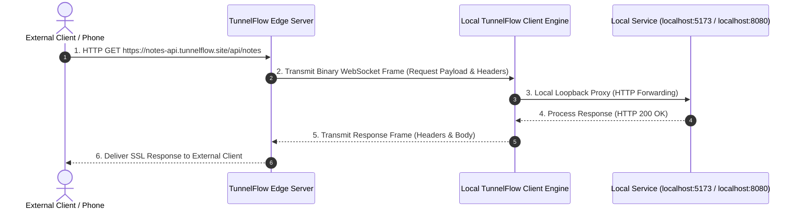
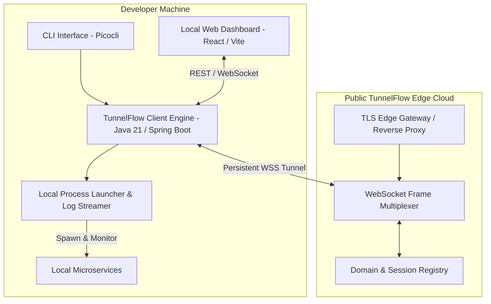

# ⚡ TunnelFlow

> **Secure Tunneling & Multi-Service Microservice Orchestration Platform**  
> Expose local ports to public SSL URLs instantly, orchestrate multi-microservice stacks, and inspect live traffic in real-time.

---

## 📖 Table of Contents

- [Overview & What It Does](#-overview--what-it-does)
- [How It Works](#-how-it-works)
- [System Architecture](#-system-architecture)
- [Key Features](#-key-features)
- [Future Improvements & Roadmap](#-future-improvements--roadmap)
- [Installation & Usage Guide](#-installation--usage-guide)
- [License & Open Source](#-license--open-source)

---

## 🚀 Overview & What It Does

**TunnelFlow** is a modern developer platform designed to eliminate the friction of exposing local development servers and orchestrating multi-service microservice architectures.

With traditional tunneling tools (like Ngrok or Cloudflare Tunnels), exposing single ports is straightforward, but managing multi-service stacks (e.g. React frontend + Spring Boot backend + Node API) requires juggling multiple terminal windows, manually copying URLs, and configuring hardcoded local IP addresses.

### What TunnelFlow Solves:
1. **Instant TCP Port Exposure**: Expose any local web server (React, Vite, Next.js, Express, Spring Boot, Python FastAPI) to a secure public SSL URL with a single click or command.
2. **Multi-Service Stack Orchestration**: Launch complex multi-service stacks from a visual wizard or a single `tunnelflow.yaml` manifest under a unified application card.
3. **Cross-Service Environment Resolution**: Reference public tunnel URLs dynamically in process environment variables using placeholders like `${backend.publicUrl}`. TunnelFlow resolves these URLs live at runtime and injects them automatically into process environments.
4. **Live Traffic & Header Inspector**: Inspect incoming HTTP request methods, full URL paths, latency, status codes, request headers, and response headers in real-time.
5. **Interactive Stack Topology Canvas**: Visualize real-time request routing across edge nodes and service lanes with animated particle dots traveling down wires directly to receiving service nodes.

---

## ⚙️ How It Works

TunnelFlow operates on a high-performance **Multiplexed WebSocket Protocol** between the local TunnelFlow Client Engine and the public TunnelFlow Edge Server.

### Core Execution Flow:
1. **Connection & Handshake**: Upon running `tunnelflow start`, the client engine establishes a persistent, bi-directional WebSocket control plane with the TunnelFlow edge server.
2. **Tunnel Provisioning**: When a port is exposed or an application stack is launched, the client sends a `CREATE_TUNNEL` frame. The edge server registers a unique sub-domain (e.g. `https://app-xyz.tunnelflow.site`) and binds it to the WebSocket channel.
3. **Request Forwarding & Frame Multiplexing**: When an external user visits the public URL, the edge server captures the HTTP request, packages it into a binary protocol frame, and multiplexes it over the active WebSocket stream.
4. **Local Proxying**: The local TunnelFlow engine unmarshals the frame, forwards the request to the target local port (e.g., `127.0.0.1:5173`), and streams the HTTP response back through the WebSocket tunnel.
5. **Runtime Env Injection**: When launching application stacks, TunnelFlow evaluates dependency graphs, waits for public SSL tunnel URLs to materialize, resolves cross-service placeholders (`${backend.publicUrl}`), and injects resolved variables into child process environment maps before executing launch commands.

---

## 🏗️ System Architecture

TunnelFlow is built as a modular multi-tier architecture:

### Component Breakdown:
- **Client Engine (`tunnelflow-cli`)**: Lightweight Java 21 / Spring Boot daemon with bundled runtime. Manages local HTTP proxying, process spawning, stdout/stderr log capturing, and WebSocket protocol framing.
- **Web Dashboard UI (`Dashboard`)**: Modern single-page web dashboard built with React, Vite, and custom CSS design system. Features dark/light themes, live topology canvas, traffic inspector, and application wizard.
- **Edge Gateway (`tunnelflow-server`)**: Scalable backend cluster handling public TLS termination, custom domain routing, and WebSocket frame relaying.

---

## 🌟 Key Features

| Feature | Description |
| :--- | :--- |
| **⚡ 1-Click Port Exposure** | Instantly expose any local port (3000, 5173, 8080) to a public SSL URL with one-click copy and browser links. |
| **🚀 App Stack Orchestrator** | Group microservices (frontend, backend, database) under unified application cards using `tunnelflow.yaml`. |
| **🎛️ Env Placeholder Injection** | Automatically resolve `${backend.publicUrl}` cross-service environment variables at runtime. |
| **📊 Request Traffic Inspector** | Monitor real-time HTTP requests, status codes, latency timings, and inspect raw HTTP request/response headers. |
| **🕸️ Interactive Stack Topology** | Visual network canvas showing live request particle dots traveling down wire paths directly to receiving service nodes. |
| **💻 Console Log Streamer** | Real-time stdout and stderr log streamer with per-microservice filtering and error highlighting. |
| **📱 Mobile QR Code Sharing** | Generate scannable high-contrast QR code tiles for 1-click testing on mobile phones and tablets. |
| **🔕 Clean Silent CLI** | Silent terminal execution mode with clean ASCII status boxes and `--debug` mode for troubleshooting. |

---

## 🔮 Future Improvements & Roadmap

We are actively developing TunnelFlow into the ultimate developer orchestration platform. Here is our roadmap for upcoming releases:

- [ ] **Custom Domain CNAME Support**: Allow developers to map their own custom domains (e.g. `api.mycompany.dev`) to TunnelFlow public tunnels.
- [ ] **End-to-End Encryption (E2EE)**: Optional client-side E2EE mode where traffic is encrypted locally before entering the tunnel stream.
- [ ] **Team Workspaces & RBAC**: Share active tunnels and multi-service stacks securely across team members with role-based access control.
- [ ] **Metrics & Prometheus Exporter**: Built-in metrics endpoint exposing request throughput, status code counts, and latency percentiles.
- [ ] **Webhooks Replay & Interception**: Replay recorded HTTP requests or modify payloads on-the-fly for rapid webhook debugging.
- [ ] **Cloud Edge Provider Plugins**: Extend edge forwarding to AWS, Cloudflare Workers, and GCP serverless runtimes.

---

## 📦 Installation & Usage Guide

For complete step-by-step installation instructions (MSI Installer & One-Command PowerShell Install) and detailed Web Dashboard usage guides with interactive media:

👉 **Visit the Official Installation & Usage Guide**: [{landing_page_url}](https://tunnelflow.rajeshbandi.site)

---

## 📄 License & Open Source

TunnelFlow is open-source software licensed under the [MIT License](LICENSE).  
Created with ❤️ for developers by [Rajesh Bandi](https://github.com/Rajesh-bandi).
