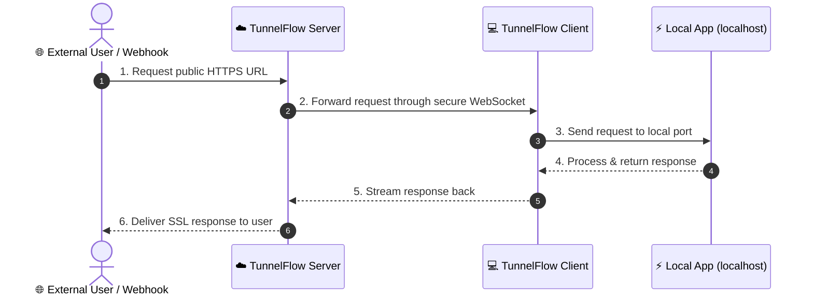
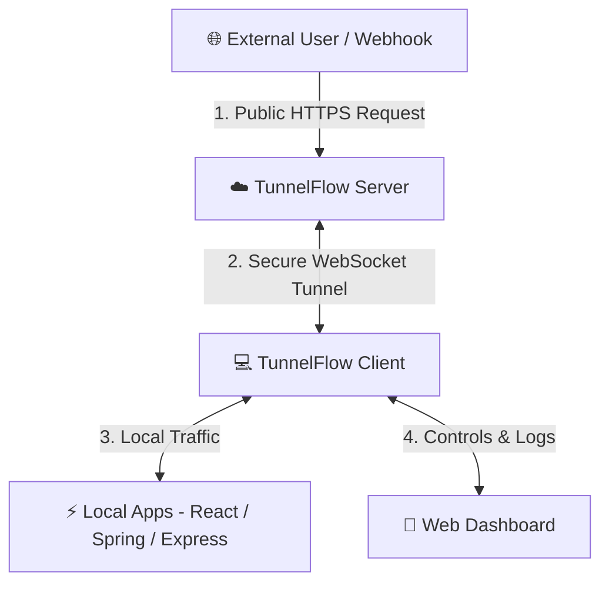

# ⚡ TunnelFlow

> **Expose Local Apps with Secure Public URLs**  
> Simple, secure tunneling and local development platform for frontend, backend, and full-stack projects.

---

## 📖 Table of Contents

- [Overview](#-overview)
- [What TunnelFlow Solves](#-what-tunnelflow-solves)
- [Features](#-features)
- [How It Works](#-how-it-works)
- [Architecture](#-architecture)
- [Future Improvements & Roadmap](#-future-improvements--roadmap)
- [Installation & Usage Guide](#-installation--usage-guide)
- [License](#-license)

---

## 🚀 Overview

TunnelFlow is an open-source tunneling tool that lets you expose your local applications to the internet through secure public URLs.

Whether you're developing a React app, Spring Boot API, Express server, or any other local service, TunnelFlow creates a public HTTPS URL that anyone can access.

Beyond simple port forwarding, TunnelFlow also helps you launch and manage multiple local services from one place, making full-stack development much easier.

---

## ❓ What TunnelFlow Solves

During development, you often need to:

- **Share your local app** with teammates or clients without deploying to staging.
- **Test webhooks** from external services like Stripe, GitHub, or Twilio.
- **Run multiple services together** (frontend and backend) with automatic URL sharing.
- **Configure applications** dynamically with public HTTPS endpoints.

TunnelFlow makes these tasks simple by providing secure public URLs, managing multiple services, and automatically connecting them together.

---

## ✨ Features

| Feature | Description |
| :--- | :--- |
| ⚡ **Public HTTPS URLs** | Expose any local port with one command or click. |
| 🚀 **Multi-App Launcher** | Start frontend, backend, and database services together. |
| 🔗 **Automatic URL Injection** | Automatically provide generated public URLs to dependent services using `${backend.publicUrl}`. |
| 📊 **Traffic Inspector** | View incoming requests, status codes, headers, and response times in real-time. |
| 📝 **Live Logs** | Watch application logs from one unified dashboard. |
| 📱 **QR Code Sharing** | Instantly test your application on mobile phones and tablets. |
| 🎨 **Web Dashboard** | Manage tunnels through a clean, modern graphical interface. |

---

## ⚙️ How It Works

TunnelFlow safely proxies traffic between external users and your local computer:

1. **Connection**: TunnelFlow connects your computer to the TunnelFlow server through a secure WebSocket connection.
2. **URL Generation**: When you expose a local port, TunnelFlow creates a public HTTPS URL.
3. **Traffic Forwarding**: Incoming requests to your public URL are forwarded through the secure connection to your local application.
4. **Processing**: Your application processes the request normally on your machine.
5. **Response Delivery**: The response is sent back to the user through the same connection.

---

## 🏗️ Architecture

TunnelFlow consists of three main components working together:

- **Client** – Runs on your computer and forwards traffic to your local applications.
- **Dashboard** – A clean web interface for managing tunnels, viewing logs, and monitoring requests.
- **Server** – Receives public traffic on the internet and securely forwards it to your connected client.

---

## 🔮 Future Improvements & Roadmap

- [ ] **Custom Domain Support**: Use your own domain names for public URLs.
- [ ] **End-to-End Encryption**: Encrypt tunnel traffic locally before sending.
- [ ] **Team Workspaces**: Share active tunnels securely across team members.
- [ ] **Webhook Replay**: Save and replay incoming requests for easy debugging.

---

## 📦 Installation & Usage Guide

For complete step-by-step installation instructions (MSI Installer & One-Command PowerShell Install) and Web Dashboard guides:

👉 **Visit the Official Installation & Usage Guide**: [{landing_page_url}](https://tunnelflow.rajeshbandi.site)

---

## 📄 License

TunnelFlow is open-source software licensed under the [MIT License](LICENSE).  
Created by [Rajesh Bandi](https://github.com/Rajesh-bandi).
